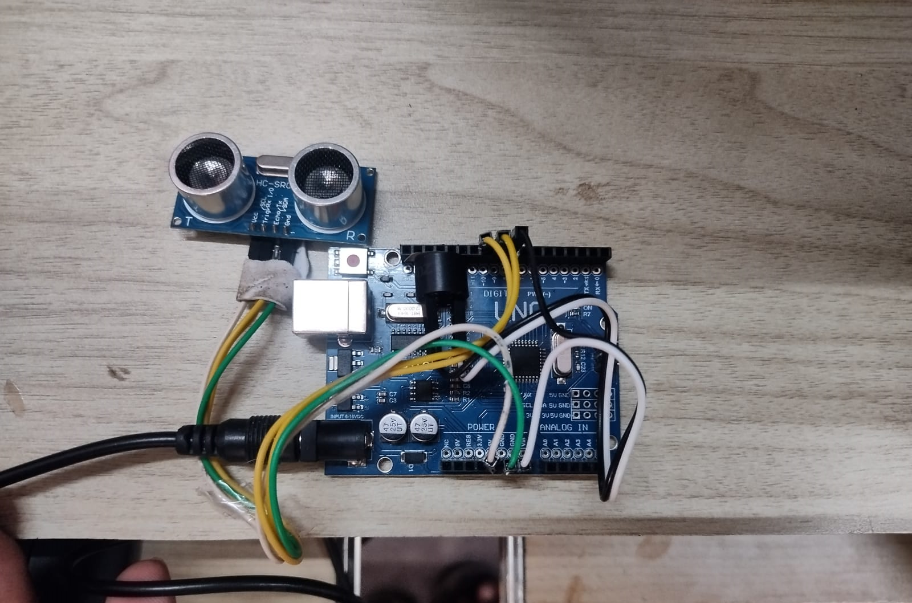

# obstacle-proximity-alert-device

This Arduino project uses an ultrasonic sensor (HC-SR04) to measure distance and provide audible feedback using a buzzer. It also outputs data over Serial for distance plotting (e.g., with Processing or Arduino Serial Plotter).

## 🧰 Components

- Arduino UNO or compatible board
- HC-SR04 Ultrasonic Sensor
- Passive Buzzer
- Jumper wires
- Breadboard

## ⚙️ Wiring

| Component     | Arduino Pin |
|--------------|--------------|
| HC-SR04 TRIG | 9            |
| HC-SR04 ECHO | 10           |
| Buzzer       | 8            |
| GND/VCC      | GND/5V       |

## 🚀 Features

- Measures distance from 2 cm to 100 cm
- Buzzer beeps faster as object gets closer
- Outputs distance data via Serial for visualization

## 🧠 How it Works

- Sends a short pulse from TRIG
- Measures how long the echo takes to return
- Calculates the distance
- If the object is within range, the buzzer sounds:
  - Closer = faster beeps
- Outputs real-time data to Serial

## 🛠️ How to Use

1. Upload the sketch to your Arduino.
2. Open Serial Monitor or Plotter (9600 baud).
3. Move your hand or object in front of the sensor.
4. Listen to the buzzer speed up as you get closer.

## 🔧 Customization

- Adjust the `map()` range to change beep frequency behavior.
- Increase max detection distance beyond 100 cm if desired.
